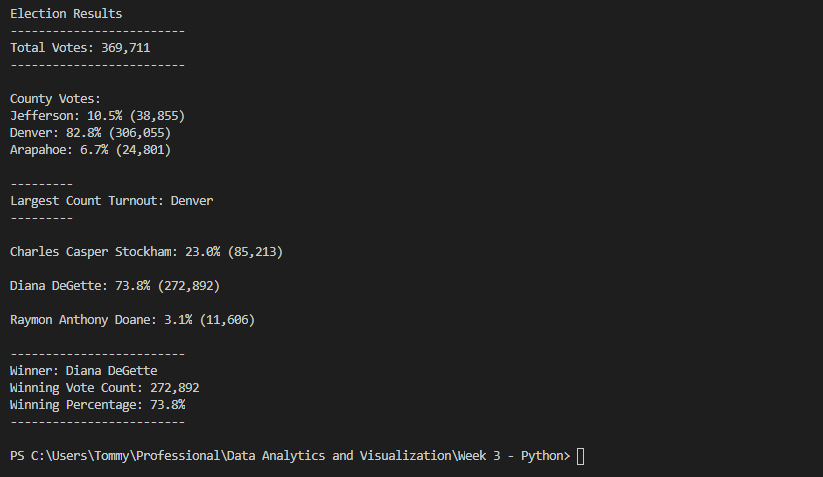

# Election-Analysis
Analysis of Election data and results through the programming language Python. With this exercise, I extracted raw data and found the total number of votes across a county. I gave statistics to support the number of votes each candidate received, found the county with the largest voter turnout, and declared a winner to the election.

## Overview of Election-Audit
The purpose of creating this Python program was to quickly and efficiently tally up the total number of votes for each candidate. This program is very useful, because it can be used going forward in the years to come. This program is adaptable in the sense that it will find new candidates and add votes to them depending on their name.

## Election-Audit Results
In this problem statement, I looked to address the following questions:

* How many votes were cast in this congressional election?
Total Votes: 369,711

* Provide a breakdown of the number of votes and the percentage of total votes for each county in the precinct.\
Jefferson: 10.5% (38,855)\
Denver: 82.8% (306,055)\
Arapahoe: 6.7% (24,801)

* Which county had the largest number of votes?
Largest Count Turnout: Denver

* Provide a breakdown of the number of votes and the percentage of the total votes each candidate received.
Charles Casper Stockham: 23.0% (85,213)

Diana DeGette: 73.8% (272,892)

Raymon Anthony Doane: 3.1% (11,606)

* Which candidate won the election, what was their vote count, and what was their percentage of the total votes?
Winner: Diana DeGette
Winning Vote Count: 272,892
Winning Percentage: 73.8%

When I ran this Python code through the Visual Studio Code program (VSC), I found the following results in my terminal. The answers to the questions above can be found in my terminal picture attached below.

