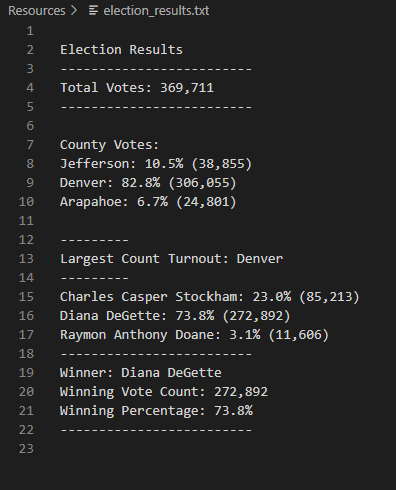

# Election-Analysis
Analysis of Election data and results through the programming language Python. With this exercise, I extracted raw data and found the total number of votes across a county. I gave statistics to support the number of votes each candidate received, found the county with the largest voter turnout, and declared a winner to the election.

## Overview of Election-Audit
The purpose of creating this Python program was to quickly and efficiently tally up the total number of votes for each candidate. This program is very useful, because it can be used going forward in the years to come. This program is adaptable in the sense that it will find new candidates and add votes to them depending on their name.

## Election-Audit Results
In this problem statement, I looked to address the following questions:

* How many votes were cast in this congressional election?\
Total Votes: 369,711

* Provide a breakdown of the number of votes and the percentage of total votes for each county in the precinct.\
Jefferson: 10.5% (38,855)\
Denver: 82.8% (306,055)\
Arapahoe: 6.7% (24,801)

* Which county had the largest number of votes?\
Largest Count Turnout: Denver

* Provide a breakdown of the number of votes and the percentage of the total votes each candidate received.\
Charles Casper Stockham: 23.0% (85,213)\
Diana DeGette: 73.8% (272,892)\
Raymon Anthony Doane: 3.1% (11,606)

* Which candidate won the election, what was their vote count, and what was their percentage of the total votes?\
Winner: Diana DeGette\
Winning Vote Count: 272,892\
Winning Percentage: 73.8%

When I ran this Python code through the Visual Studio Code program (VSC), I found the following results in my terminal. The answers to the questions above can be found in my terminal picture attached below.

In addition to using the Terminal to see my results, I also thought it was important to display my results in a txt file for others to see. Using Python, I created a .txt file to diplay my findings to others. The results of my .txt file are shown below from the VSC interface. I have uploaded the .txt file to the analysis folder in my GitHub respiratory.

## Election-Audit Summary
The code used to analyze the voting results in this election is quite robust. In fact, I believe the foundation of this code can be used to determine elections in the future. Unlike some codes, this election code searches for different candidates and creates them. This way all candidates are accounted for in the election. This style of election code written can be used for others things as well. If we wanted to go a step beyond to imrpove this program, I believe we could have very easily implemented a party type category for each candidate running. From this data, we could have also broke down things like the % of voters who are republican or democrat from a certain area, and we could compare which counties are most alike and different in terms of political state. In addition, one more thing we could have adjusted would be to add more areas beyond a county. For instance, we could make a larger scale poll for a state, in which the vote was tracked amonst 50 different states in the United States for a large scale poll.
